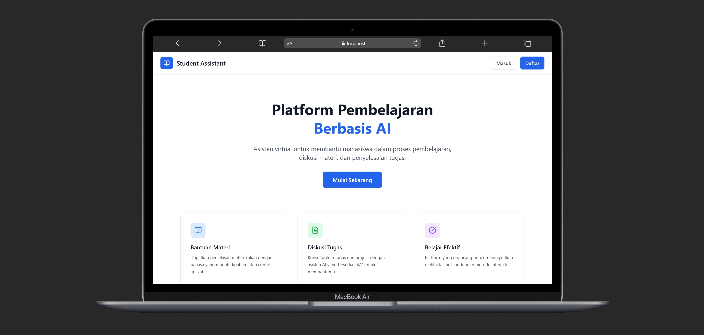
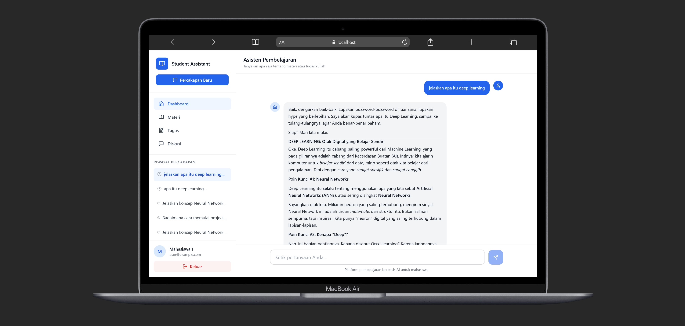
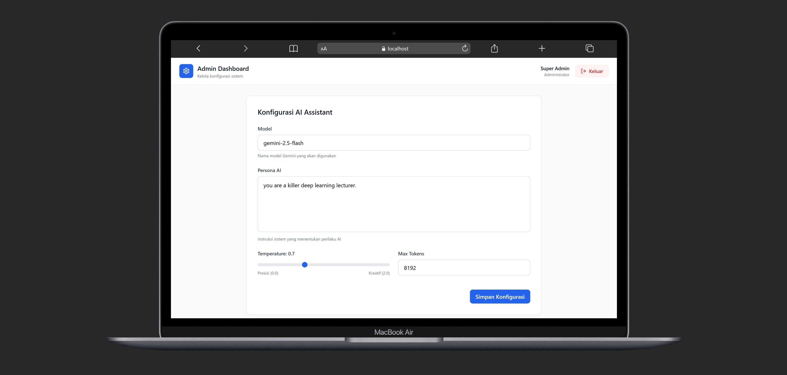
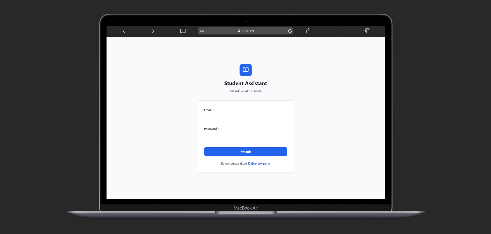
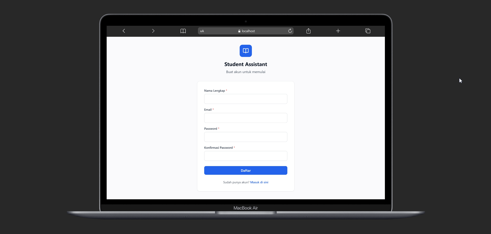

# **🤖 AI Chat Application \- Deep Learning Lanjut**

Aplikasi AI Chatbot interaktif yang mengintegrasikan **Generative AI (Google Gemini)** dengan arsitektur **Decoupled (React & Laravel 11\)**. Proyek ini dibangun sebagai pemenuhan Ujian Akhir Semester (UAS) untuk mata kuliah Deep Learning Lanjut.

Berbeda dengan chatbot konvensional, aplikasi ini memanfaatkan _Large Language Model_ (LLM) untuk memahami konteks percakapan secara dinamis dan memungkinkan modifikasi "kepribadian" AI secara _real-time_ lewat dasbor admin.

## **✨ Fitur Utama**

### **💬 1\. Antarmuka Percakapan Cerdas (Smart Chat)**

- Interaksi chat responsif menggunakan **React.js**.
- Pendekatan _Optimistic UI_ untuk pengalaman pengguna yang mulus.
- Indikator mengetik (Typing Animation) yang natural.
- Pengelompokan riwayat percakapan secara otomatis (Sidebar History).

### **🧠 2\. Integrasi Generative AI & Memori**

- Terhubung langsung dengan **Google Gemini API** (gemini-2.5-flash).
- **Contextual Memory**: AI mampu mengingat konteks dari 10 percakapan sebelumnya (diambil dari database).
- Bypass batasan _stateless_ pada API REST konvensional.

### **⚙️ 3\. Manajemen Persona AI (Admin Panel)**

- Konfigurasi _System Instruction_ (Peran/Sifat AI) secara _real-time_.
- Pengaturan _Temperature_ (Tingkat kreativitas/logika).
- Pengaturan _Max Tokens_ (Panjang maksimal balasan).
- Pemilihan _Model Name_ yang dinamis (contoh: gemini-2.5-flash / gemini-pro).

### **🔒 4\. Autentikasi & Multi-Role**

- Registrasi dan Login pengguna yang aman.
- Autentikasi API berbasis token menggunakan **Laravel Sanctum**.
- Pemisahan hak akses antara Admin (mengelola sistem) dan User (pengguna chat biasa).

## **🧩 Struktur Database**

### **👤 Tabel Users**

| Field      | Keterangan        |
| :--------- | :---------------- |
| id (PK)    | ID unik           |
| name       | Nama lengkap user |
| email      | Email unik user   |
| password   | Password (Hashed) |
| role       | admin atau user   |
| timestamps | Otomatis Laravel  |

### **💬 Tabel Conversations**

| Field        | Keterangan            |
| :----------- | :-------------------- |
| id (PK)      | ID unik percakapan    |
| user_id (FK) | Relasi ke tabel users |
| title        | Judul chat otomatis   |
| timestamps   | Otomatis Laravel      |

### **📝 Tabel Messages**

| Field           | Keterangan                     |
| :-------------- | :----------------------------- |
| id (PK)         | ID unik pesan                  |
| conversation_id | Relasi ke conversations        |
| role            | Siapa yang bicara (user/model) |
| content         | Isi teks percakapan            |
| timestamps      | Otomatis Laravel               |

### **⚙️ Tabel AI Settings (Singleton)**

| Field              | Keterangan                            |
| :----------------- | :------------------------------------ |
| id (PK)            | ID unik (Selalu 1\)                   |
| system_instruction | Persona / Instruksi untuk AI          |
| model_name         | Nama model Gemini                     |
| max_tokens         | Batas output token                    |
| temperature        | Parameter kreativitas AI (0.0 \- 2.0) |
| timestamps         | Otomatis Laravel                      |

## **⚙️ Instalasi**

Pastikan **PHP 8.2+**, **Node.js**, **Composer**, dan **MySQL** telah terinstal.

1. **Clone repository (Jika menggunakan Git)**

git clone \[https://github.com/RizaAlraihany/uai\_chat\_project.git\](https://github.com/RizaAlraihany/uai\_chat\_project.git)  
cd uai_chat_project

2. **Setup Backend (Laravel)**

cd backend  
composer install  
cp .env.example .env  
php artisan key:generate

3. **Konfigurasi Database & API Key di .env (Backend)**

DB_DATABASE=ai_chat_db  
DB_USERNAME=root  
DB_PASSWORD=

\# Dapatkan API Key dari Google AI Studio  
GEMINI_API_KEY=KODE_RAHASIA_GEMINI_ANDA

4. **Jalankan Migrasi & Seeder**

php artisan migrate:fresh \--seed

5. **Jalankan Server Backend**

php artisan serve

6. **Setup Frontend (React / Vite) \- Buka Terminal Baru**

cd frontend  
npm install  
npm run dev

## **🔑 Login Default**

Akun ini dibuat otomatis saat Anda menjalankan php artisan migrate:fresh \--seed.

| Role  | Email             | Password    | Akses                 |
| :---- | :---------------- | :---------- | :-------------------- |
| Admin | admin@example.com | password123 | Chat & Dasbor Persona |
| User  | user@example.com  | password123 | Antarmuka Chat Saja   |

## **🖯️ Routes Utama (API)**

### **🔐 Autentikasi (Public)**

- POST /api/register – Daftar akun baru
- POST /api/login – Autentikasi dan ambil token Sanctum

### **💬 Percakapan (Protected: User & Admin)**

- GET /api/conversations – Ambil daftar riwayat chat user
- POST /api/chat – Kirim pesan ke AI dan simpan ke database
- POST /api/logout – Akhiri sesi (Hapus Token)

### **⚙️ Pengaturan AI (Protected: Admin Only)**

- GET /api/admin/settings – Ambil data konfigurasi AI saat ini
- POST /api/admin/settings – Perbarui Persona, Model, dan Parameter AI

## **🧪 Teknologi yang Digunakan**

| Komponen     | Teknologi                                |
| :----------- | :--------------------------------------- |
| **Backend**  | Laravel 11                               |
| **Frontend** | React.js (Vite)                          |
| **Database** | MySQL                                    |
| **AI Model** | Google Gemini API                        |
| **Styling**  | Tailwind CSS                             |
| **Icons**    | Lucide React                             |
| **HTTP**     | Axios (Frontend) & Http Facade (Backend) |

## **🔒 Keamanan**

- **Sanctum Authentication**: Melindungi API Endpoint dengan Bearer Tokens.
- **CSRF Protection**: Stateful routing middleware dengan sanctum/csrf-cookie.
- **Role-Based Access Control (RBAC)**: Kustom middleware AdminMiddleware untuk memblokir akses _user_ biasa ke dasbor AI.
- **CORS Restricted**: API hanya menerima _request_ dari domain Frontend yang didaftarkan.

## **🚀 Optimasi**

- **Context Window Management**: Backend secara cerdas hanya menyuntikkan 10 pesan terakhir ke dalam _payload_ Gemini API agar tidak membebani limit token.
- **Optimistic UI Updates**: Pesan pengguna ditampilkan langsung di antarmuka React sebelum menunggu respon _delay_ jaringan API.

## **📸 Preview Tampilan**

| Halaman Landing  |
| :--------------- |
|  |  

| Halaman Chat (User) | Admin Dashboard (Persona) |
| :------------------ | :------------------------ |
 |||

 | Halaman Log-In | Halaman Register |
| :------------------ | :------------------------ |
 |||

## **🗁 Struktur Folder**
---

```
 /ai-chat-project
├── frontend/                           # React Application
│   ├── public/
│   │   └── vite.svg                   # App icon
│   │
│   ├── src/
│   │   ├── App.jsx                    # Core UI, State, & Logic
│   │   ├── main.jsx                   # Entry point
│   │   ├── index.css                  # Global styles & Tailwind
│   │   │
│   │   └── assets/                    # Static assets
│   │
│   ├── .gitignore
│   ├── package.json                   # Dependencies & scripts
│   ├── vite.config.js                 # Vite configuration
│   ├── tailwind.config.js             # Tailwind configuration
│   ├── postcss.config.js              # PostCSS configuration
│   ├── eslint.config.js               # ESLint rules
│   └── README.md
│
├── backend/                            # Laravel Application
│   ├── app/
│   │   ├── Http/
│   │   │   ├── Controllers/
│   │   │   │   ├── AuthController.php        # Registration, Login, Logout
│   │   │   │   ├── ChatController.php        # Chat & Conversations
│   │   │   │   └── AdminController.php       # AI Settings Management
│   │   │   │
│   │   │   ├── Middleware/
│   │   │   │   ├── AdminMiddleware.php       # Admin-only access
│   │   │   │   └── VerifyCsrfToken.php       # CSRF exclusions
│   │   │   │
│   │   │   └── Kernel.php                    # Middleware registration
│   │   │
│   │   ├── Models/
│   │   │   ├── User.php                      # User model with roles
│   │   │   ├── Conversation.php              # Conversation model
│   │   │   ├── Message.php                   # Message model
│   │   │   └── AiSetting.php                 # AI configuration
│   │   │
│   │   └── Services/
│   │       └── GeminiService.php             # Gemini API integration
│   │
│   ├── bootstrap/
│   │   └── app.php                           # Application bootstrap
│   │
│   ├── config/
│   │   ├── app.php                           # App configuration
│   │   ├── cors.php                          # CORS settings
│   │   ├── database.php                      # Database config
│   │   └── sanctum.php                       # Sanctum settings
│   │
│   ├── database/
│   │   ├── migrations/
│   │   │   ├── 0001_01_01_000000_create_users_table.php
│   │   │   ├── 0001_01_01_000001_create_cache_table.php
│   │   │   ├── 2019_12_14_000001_create_personal_access_tokens_table.php
│   │   │   ├── 2024_01_01_000001_create_ai_settings_table.php
│   │   │   ├── 2024_01_02_000001_create_conversations_table.php
│   │   │   └── 2024_01_03_000001_create_messages_table.php
│   │   │
│   │   └── seeders/
│   │       └── DatabaseSeeder.php            # Default users & settings
│   │
│   ├── routes/
│   │   ├── api.php                           # API routes
│   │   ├── web.php                           # Web routes
│   │   └── console.php                       # Console commands
│   │
│   ├── storage/
│   │   ├── app/
│   │   ├── framework/
│   │   └── logs/                             # Application logs
│   │
│   ├── .env.example                          # Environment template
│   ├── .gitignore
│   ├── artisan                               # Laravel CLI
│   ├── composer.json                         # PHP dependencies
│   └── README.md
│
├── asset/                        # Application screenshots
│   ├── landingPage.png
│   ├── chat.png
│   ├── admin.png
│   ├── login.png
│   └── register.png
│
└── README.md                           # This file
```

---

## **🧬 Rencana Pengembangan Berikutnya**

- \[ \] Dukungan fitur _Multimodal_ (Upload gambar ke AI).
- \[ \] Implementasi respons _Streaming_ (Mengetik kata per kata seperti ChatGPT asli).
- \[ \] Opsi ganti tema terang / gelap (Dark Mode).
- \[ \] Ekspor riwayat percakapan ke PDF / Txt.

## **👨‍💻 Pengembang**

**Dibuat oleh:** 
- [Ahmad Ramdhani](https://github.com/Ahmadramdhnau28)
- [Alfhad Rizqon A](https://github.com/Alfhadrizqon)
- [Angga Permana](https://github.com/AnggaPermana)
- [Riza Alraihany](https://github.com/RizaAlraihany)

📧 Terbuka untuk kolaborasi & pengembangan fitur baru.

## **🦦 License**

MIT License – silakan digunakan untuk keperluan komersial maupun non-komersial.

“Membangun jembatan antara imajinasi dan realitas melalui kecerdasan buatan.” 🤖✨
